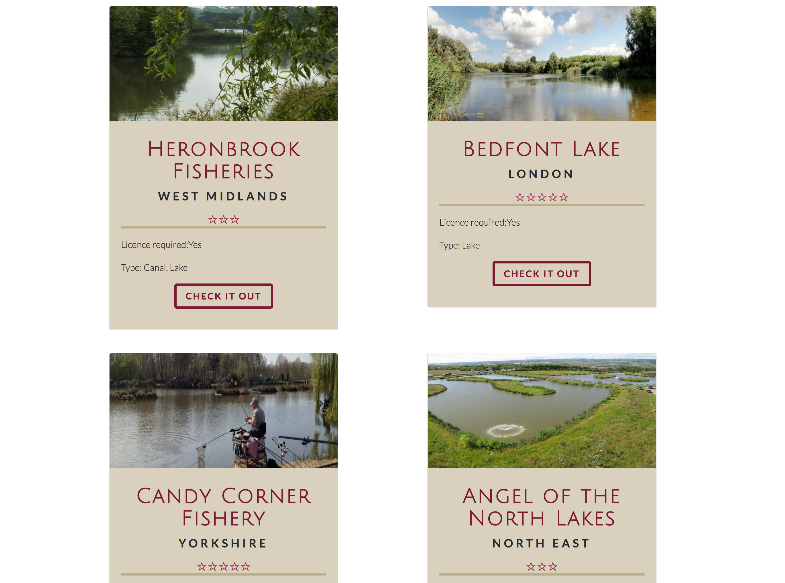
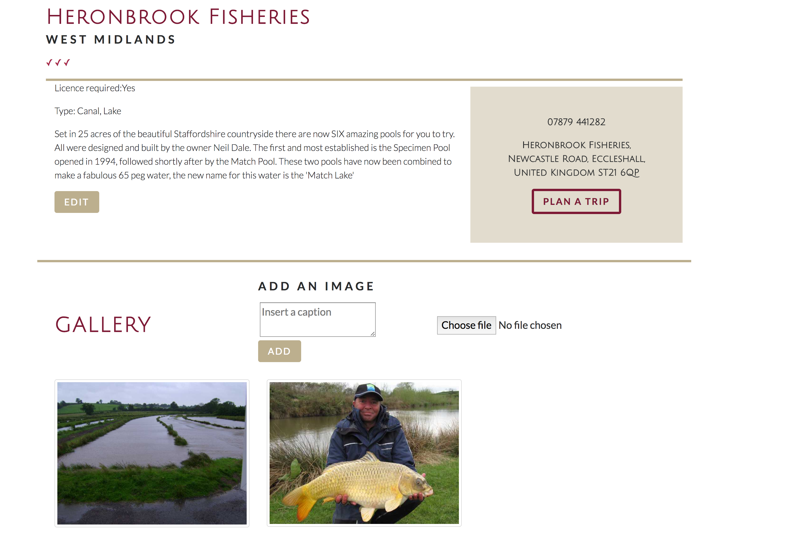
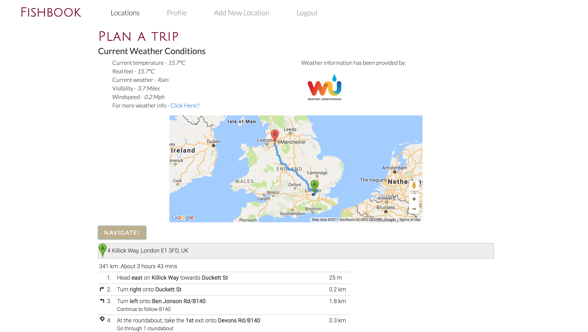

# Project-2

## FishBook

GA WDI London - Project 2

For the second project we were tasked with created an Express App with user created data and to manipluate one external API.

When I was younger my dad used to take me fishing and have joked about making a fishing related website for some time.

[See it here!](https://enigmatic-meadow-18873.herokuapp.com/)

### Approach / How it works

Users can add places that they have been to fish in the UK and feed back information and upload photos about that specific fishing spot. The aim was to create a platform for people who really enjoyed fishing and registering and logging in gave them the benifit of being able to review.

Alongside this I maniuplate the Wunderground Weather App and Google Maps API to provide current weather conditions and directions for driving to each location through the plan a trip option.

JavaScript, jQuery, SCSS, HTML, Express.js, Node.js, MongoDB, Mongoose, Bcrypt, AJAX, JSON, AWS, Google Maps API, Wunderground Weather API, Bootstrapand  Gulp were used to create this game.

Colour coordination was established by using Coolers and the landing page image was taken from Unsplashed.

The Google Web Font 'Julius Sans One' and  'Lato' & were used to style the site.

### Problems & Challenges

The most difficult problem that I encountered was dealing with double embedded Schemas in mongoose and manipulating this on the back end. After a lot of trial and error I managed to succeed and am relatively happy with the way the site and its styling turned out.